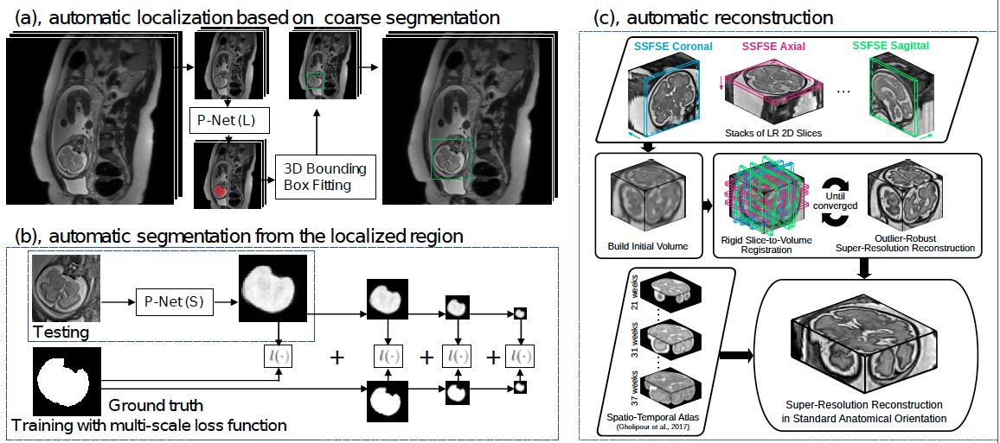

# Automatic Fetal Brain Reconstruction
This repository provides scripts to use NiftyMIC for fetal brain reconstruction according to the following paper

* [1] Michael Ebner*, Guotai Wang*, Wenqi Li, Michael Aertsen, Premal A. Patel, Rosalind Aughwane, Andrew Melbourne, Tom Doel, Anna L. David, Jan Deprest, Sebastien Ourselin, Tom Vercauteren. "An automated localization, segmentation and reconstruction framework for fetal brain MRI." In International Conference on Medical Image Computing and Computer-Assisted Intervention (MICCAI), pp. 313-320. 2018.

*    '*' authors contributed equally.

The localization, segmentation and reconstruction framework is dipicted in the following figure:

Fetal brain localization and segmentation code is available at https://github.com/gift-surg/fetal_brain_seg

The core functions of image reconstruction is available at https://github.com/gift-surg/NiftyMIC

# How to use
1, Download the `fetal_brain_seg` code and `NiftyMIC` code from the above links.

2, Use `fetal_brain_seg` to obtain segmentation masks of fetal MR stacks. 

3, Run the script `bash_pipeline.sh` for high resolution volume reconstruction. You may need to edit the environmental variables in the script. Please see `reconstruction_multi_patients.py` to set input data and different reconstruction methods.

# Acknowledgement
This work is part of the GIFT-Surg project (https://www.gift-surg.ac.uk/). It is supported by Wellcome Trust [WT101957; 203145Z/16/Z], EPSRC [EP/L016478/1; NS/A000027/1; NS/A000050/1], and the NIHR UCLH BRC.
